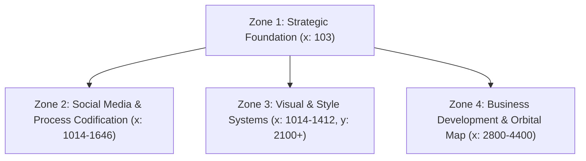

# Canvas Workspace Analysis — thegardeninthemachine

This document provides a comprehensive analysis and synthesis of `thegardeninthemachine` canvas workspace folder. It acts as the blueprint for both the visual styling of this project and the operational rules for lead discovery and client prospecting.

---

## 1. Workspace Structural Layout
The Obsidian Canvas (`canvas.json`) is organized into four distinct horizontal/vertical regions:



### Zone 1: Strategic Foundation
* **Note:** `260601 First Meet with Parag` / `260601_Brainstorming_Session.txt`
* **Core Context:** Defines client discovery briefs, pricing ($500–$700 project fee), timeline boundaries (1 week discovery, 2 weeks development, 3-4th week refinement), and strict security policies (no root access; predefined sandboxed folder structures).
* **Target Audience:** Primariliy B2B. Usability is focused on streamlining creative production for the business rather than consumer page layouts.

### Zone 2: Social Media & Process Codification
* **Note:** `note-mpx4okrj.txt`
* **Core Context:** Outlines precedent analyses (extracting posting patterns to guide automation templates), agent harnesses (Hermes "hats"), and Adobe automation pipelines using `osascript` + `ExtendScript` for stitching narration, subtitles, and compositions into MP4 reels.
* **Precedent Case Study:** Fuser Studio (`fuser.studio` and `@fuserstudio` on Instagram). Focus is on rating relevant content and bootstrapping presentation assets.

### Zone 3: Visual & Style Systems
* **Files:** `samlay-xyz-styles` (CSS Tokens) and `Style Guide.html` (interactive design page).
* **Core Context:** Details the visual style guide of `samlay.xyz`—a quiet, ink-on-white editorial identity with cobalt accents, modern grotesque typography, liquid transitions, and the organic "bean" signature glyph.

### Zone 4: Business Development & Orbital Map
* **Files:** `note-mpx5a7o2.txt` and `client-discovery-engine.html`
* **Core Context:** A React/Babel-powered interactive cluster map visualizing target industry sectors, seed clients (existing roster), discovered leads, and public channel sources.
* **Outreach Strategy:** LinkedIn Sales Navigator sourcing, mutual connection mining, and drafting personalized cold emails incrementally.

---

## 2. Branding & Design System
Any UI code, React modules, mockups, or public-facing assets created for this project must strictly comply with the following tokens:

### Color Palette

| Token | Hex | Use Cases |
| :--- | :--- | :--- |
| **Paper** | `#FFFFFF` | Primary background surface |
| **Paper Soft** | `#FAFBFC` | Recessed areas, drawers, card backgrounds |
| **Ink** | `#1A1A1A` | Headings, labels, active states, body title |
| **Ink Body** | `#3A3F48` | Standard body text copy |
| **Muted** | `#8A92A0` | Secondary metadata, captions, inactive nav states |
| **Rule** | `#EEF0F3` | Hairline dividers (1px solid border) |
| **Accent** | `#2A78D8` | Cobalt color for hovers, active links, underlines |
| **Accent Deep** | `#1F6FD6` | Pressed states, core bean color |

### Typography
1. **Hanken Grotesk** (Weights: 400, 500, 600) — Used for headings, card titles, navigation labels, and standard copy.
2. **JetBrains Mono** (Weights: 400, 500) — Used strictly for small structural captions, metadata, uppercase labels, and signatures.

### The "Bean" (Signature Shape)
An organic, liquid-like kidney/bean SVG element that drifts slowly on welcome screens or headers.
* **SVG Path:**
  ```xml
  <svg width="0" height="0" style="position:absolute" aria-hidden="true">
    <defs>
      <clipPath id="beanClip" clipPathUnits="objectBoundingBox">
        <path d="M0.61745,0.00588 c0.10921,-0.006,0.18601,0.01834,0.22521,0.05653 s0.07201,0.08369,0.05895,0.16290 S0.82647,0.38516,0.88524,0.50540 s0.16168,0.21501,0.07675,0.35506 S0.31864,1.09687,0.09001,0.80527 0.15856,0.21258,0.26797,0.13619 0.49170,0.01279,0.61745,0.00588 Z" />
      </clipPath>
    </defs>
  </svg>
  ```
* **Motion Spec:** Drift animation utilizing alternating scale and position loops lasting 6–17s.

### Ambient Image Placeholders
When loading or in the absence of a real image cover, use soft radial gradients instead of generic gray blocks or missing-file icons:
* **Haze:** `radial-gradient(80% 80% at 30% 30%, #cfe4ff 0%, #eaf3ff 60%, #fafbfc 100%)`
* **Sky:** `radial-gradient(80% 80% at 70% 30%, #a5f3fc 0%, #eaf6fb 60%, #fafbfc 100%)`
* **Periwinkle:** `radial-gradient(80% 80% at 50% 70%, #c8d4ff 0%, #ecefff 60%, #fafbfc 100%)`

---

## 3. Targeted B2B Sectors & Roster
The `client-discovery-engine.html` identifies 8 core industries. Below is the structured roster of seed clients (pre-verified list) and discovery leads (prospecting pipeline):

| Industry | Seed Clients (Affinities) | Discovery Leads (Prospects) | Public Lead Channels / Sources |
| :--- | :--- | :--- | :--- |
| **Fashion** | Reformation, Dôen, Christy Dawn, Jenni Kayne, Mother Denim, Cuyana, Faherty, Brixton, Outerknown | Ganni, Sézane, Khaite, Aritzia, Everlane, Uniqlo | Vogue Business 100, BoF 500, Shopify Plus Index, Instagram Verified |
| **Tech** | Oura, Peak Design, Teenage Engineering, Nothing, Framework, Moft, Analogue, Rivian | Whoop, Arc, Rabbit, Humane, Brilliant, Plaud | Product Hunt, Fast Company Most Innovative, Kickstarter, CES Exhibitors |
| **Entertainment** | Earwolf, Maximum Fun, Pushkin, Wondery, Team Coco, Crooked Media, iHeart, Radiotopia | SmartLess, Pineapple Street, QCODE, Lemonada, Kast Media | Podcast Movement, Edison Research, Apple Podcasts Charts |
| **Film** | A24, Neon, Annapurna, Anonymous Content, Hungry Man, Smuggler, MJZ, Park Pictures | Imaginary Forces, Buck, PRETTYBIRD, Iconoclast, Ghetto Film School | AICP Roster, Shoot Online, Vimeo Staff Picks, A24 Alumni |
| **Music** | Stones Throw, Ninja Tune, Ghostly Intl, Sub Pop, Domino, Brainfeeder, Secretly Group, Dirty Hit | XL Recordings, Mom + Pop, Jagjaguwar, 4AD, Future Classic | Pitchfork, Bandcamp, Resident Advisor, SXSW Showcase |
| **Lifestyle** | REI, Parachute, Brooklinen, Our Place, Caraway, Vuori, Alo Yoga, Hydro Flask | Erewhon, Great Jones, Outdoor Voices, Yeti, Bobbie | Goop Network, Condé Nast Traveler, DTC Newsletter, Amazon Handmade |
| **Art & Design** | Pentagram, Collins, Order, Gretel, Various Projects, Perron-Roettinger, &Walsh, Base | Hassan Rahim, Studio Dumbar, Bielke&Yang, Porto Rocha, Instrument | AIGA Directory, It's Nice That, Dribbble, Brand New |
| **Hospitality** | Ace Hotel, The Line, Sydell, Sqirl, Gjelina, Sightglass, Verve Coffee, Blue Bottle | Soho House, Proper Hotel, Joshua Tree House, Onda, Kismet | Michelin Guide, Eater LA, Resy, Condé Nast Traveler |

---

## 4. Mapping to Active Agent Operations
The canvas structure maps directly to our active agent roles under `Agent_Operations/`:

1. **Manager (`Manager`):** Coordinates task flow and deadlines in alignment with Zone 1 notes.
2. **Sales Navigator (`Sales-Navigator`):** Implements B2B client prospecting using LinkedIn Sales Navigator, matching discovered leads with seed lists mapped in Zone 4.
3. **Outreach Automation Engineer (`Outreach-Automation-Engineer`):** Deploys automated scrapers and orchestrators (e.g. `orchestrator.js` & `sales_nav_adapter.js`) to find candidates and generate personalized email/connection drafts.
4. **Media Scout (`Media-Scout`):** Executes post analysis and metadata gathering on social precedents to feed n8n workflows outlined in Zone 2.
5. **Business Development Coordinator (`Business-Development-Coordinator`):** Manages connection pipelines, schedules, and communication channels.
