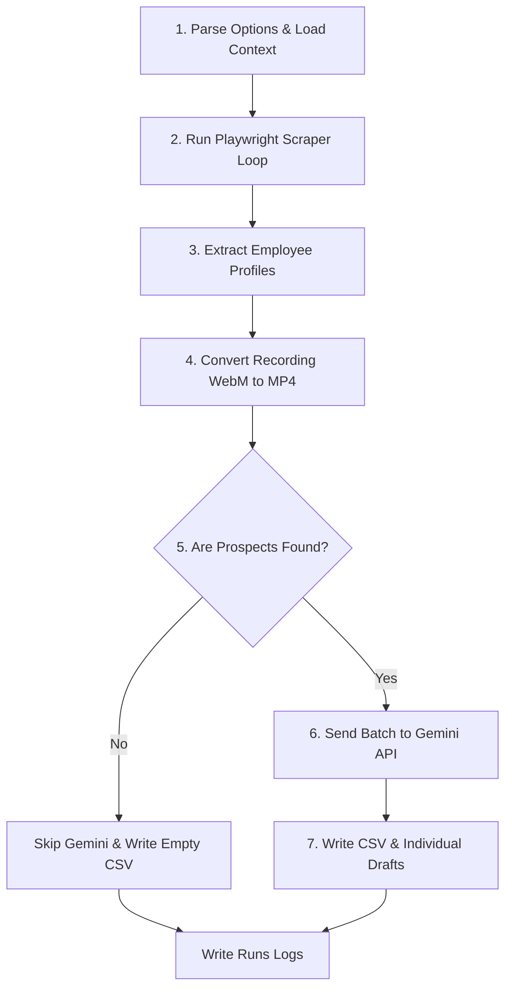

# Sales Navigator Lead Generation Pipeline: Step-by-Step Walkthrough

This document walks through the technical execution flow of the B2B prospecting pipeline when running [orchestrator.js](file://Agent_Operations/Pipelines/Outreach/orchestrator.js).

---

## 1. Step-by-Step Execution Flow

### Step 1: Initialization & Context Loading
* **CLI Parameter Reading:** Parses command-line flags like target companies (e.g. `--companies "Pentagram,Order"`), scraping depth (`--limit`), visual headed mode (`--headed`), and real runs (`--real` vs `--dry-run` mock mode).
* **Context Ingestion:** Loads [company_profile.md](file://Agent_Operations/Prompts/Guidelines/company_profile.md) (Emergentic's service positioning around AI event simulations) and [outreach_guidelines.md](file://Agent_Operations/Prompts/Guidelines/outreach_guidelines.md) (standards for quiet, low-hype, short-form copywriting).

### Step 2: The Scraper Adapter Loop
For each target company, the script executes the scraper in [sales_nav_adapter.js](file://Agent_Operations/Pipelines/Outreach/sales_nav_adapter.js):
* **Browser Launch:** Launches Playwright Chromium with a stealth plugin to prevent fingerprint profiling.
* **Session Restoration:** Automatically loads authentication state cookies from [auth.json](file://Agent_Operations/Tools/Scrapers/Playwright/auth.json) to bypass standard login pages.
* **Recording Initialization:** Configures visual capture to record the run.
* **Filter Interaction:**
  1. Navigates directly to the empty Lead Search panel.
  2. Dismisses any blocking walkthrough popovers (coach-marks).
  3. Expands the **Current company** accordion filter.
  4. Clicks the text box and types the name letter-by-letter to trigger the search listeners.
  5. Performs case-insensitive matching against autocomplete suggestions to click the exact target company (e.g. selecting `COLLINS` instead of `Collins Aerospace`).
* **Human-like Scrolling:** Staggers page scrolling to dynamically load all search result list items.

### Step 3: Profile Extraction
For each person on the results list, it extracts:
* **Name & Job Title:** Parsed from DOM list elements.
* **Sales Nav URL:** Parsed from relative links.
* **Mutual Connections:** Scans for shared network status text.

### Step 4: Screen Recording Conversion
Once the browser context is closed, the script uses a child process to call `ffmpeg` to transcode Playwright's native `.webm` screen recording into an `.mp4` video inside the campaign folder, deleting the source webm file upon completion.

### Step 5: Batch AI Evaluation
All scraped profiles are compiled into a single array:
* **Guard Check:** If the profile count is 0, the script skips the LLM API call entirely.
* **Single Batch call:** Sends the profiles, company details, and outreach guidelines to the **Gemini API** (`gemini-1.5-flash`) requesting a structured JSON payload containing a fit score, custom angles, and a cold letter draft for each person.
* **Cost Tracker:** Logs the exact session and cumulative token counts + calculated USD pricing.

### Step 6: Exporting Outputs
Writes all compiled data into target campaign outputs:
* **CSV Spreadsheet:** Generates [scraped_leads.csv](file://Agent_Operations/Execution_Logs/Sales_Nav_Campaign_1/scraped_leads.csv) with columns for name, title, url, connections, score, notes, and outreach letter draft.
* **Markdown Files:** Saves individual text drafts under the `drafts/` directory for manual inspection.
* **Execution Logs:** Saves `run_log.json` recording total execution time, targets, and any scraper errors.
