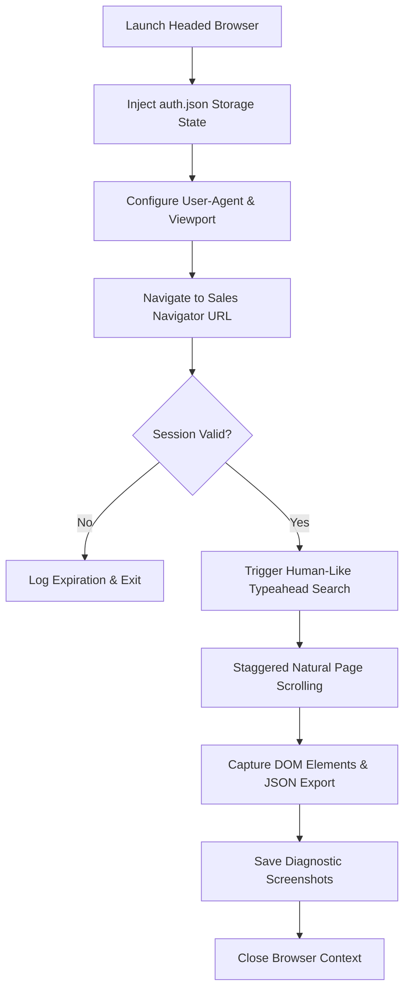

# Technical Architecture Report: LinkedIn Sales Navigator Automation

This document provides a comprehensive technical overview of the LinkedIn Sales Navigator automation engine. It details the setup prerequisites, the end-to-end operational workflow, and a developer playbook for expanding features. It is structured for developers, product managers, and technical supervisors.

---

## 1. Implementation Prerequisites & Setup

Automating LinkedIn interactions requires a highly customized browser automation stack to ensure session persistence and bypass anti-bot detection walls.

### A. Core Software Dependencies
The system runs on **Node.js** and relies on three key packages tracked in `package.json`:
1. **`playwright`** (`^1.60.0`): The base automation framework. It manages browser instances, context states, and handles asynchronous page actions (clicks, keypresses, waiting for selectors).
2. **`playwright-extra`** (`^4.3.6`): A wrapper around Playwright that enables middleware plugins.
3. **`puppeteer-extra-plugin-stealth`** (`^2.11.2`): The critical stealth layer. It overrides browser fingerprints (navigator properties, WebGL configurations, and chrome runtime parameters) to prevent cloud security tools (like Cloudflare or Akamai) from flagging the instance as automated.

### B. Sandbox Setup
To compile and execute, the local system must have the browser binaries installed:
```bash
# Install NPM packages
npm install

# Fetch and install the Playwright Chromium browser engine
npx playwright install chromium
```

### C. Session Capturing Pattern (`save-session.js` & `auth.json`)
LinkedIn employs aggressive login challenge mechanisms (CAPTCHAs and 2FA). Programmatic logins are brittle and frequently flag accounts. The engine bypasses this using **Session State Serialization**:
1. **Headed Setup**: `save-session.js` launches a visual Chromium window (`headless: false`).
2. **Manual Login**: The human operator logs in manually, enters their credentials, and solves any CAPTCHAs or 2FA prompts in the browser window.
3. **State Capture**: Once the operator confirms login and presses `[ENTER]` in the terminal, the script captures all current browser cookies, local storage, and session tokens, serializing them to **`auth.json`**:
   ```javascript
   await context.storageState({ path: 'auth.json' });
   ```
4. **Subsequent Bypass**: For future scraping runs, the engine loads `auth.json` directly into the browser context, loading the logged-in session instantly and bypassing the login screen entirely.

---

## 2. Operational Workflow

The scraping script ([sales_nav_adapter.js](file://Agent_Operations/Pipelines/Outreach/sales_nav_adapter.js)) runs an end-to-end pipeline structured to mimic realistic human user habits.



### End-to-End Steps:
1. **Initialize Browser Context**: Launches Chromium with arguments to disable automation flags:
   ```javascript
   const browser = await chromium.launch({
     headless: false,
     args: ['--disable-blink-features=AutomationControlled']
   });
   ```
2. **Inject Session State**: Injects `auth.json`, overrides the `userAgent` to match a standard macOS Chrome version, and sets a standard `1280x800` viewport to avoid responsive mobile layouts.
3. **Target Navigation**: Navigates directly to the target URL (e.g. `https://www.linkedin.com/sales`).
4. **Validation Check**: Checks the final URL. If the page is redirected to `linkedin.com/login`, the engine detects session expiration, exits cleanly, and alerts the operator to re-authenticate.
5. **Human Interaction Simulation**:
   - **Cursor Simulation**: Before clicking input fields, the engine uses `.hover()` to trigger CSS hover effects and JavaScript mouse events.
   - **Typing Humanizer**: Text is not pasted instantly. The engine loops through each character and adds random delays (50ms to 150ms) to simulate keyboard typing speed:
     ```javascript
     for (const char of text) {
       await page.type(selector, char);
       await sleep(50, 150);
     }
     ```
   - **Natural Scrolling**: Simulates reading page results by executing random page scrolls (150px to 450px) followed by staggered rest delays (800ms to 2000ms).
6. **Diagnostics & Captures**: Saves visual verification screenshots (e.g. `sales-nav-search-results.png`) and dumps the parsed profile listings to a JSON object.

---

## 3. Feature Expansion Playbook

Developers can expand this framework to build active outreach campaigns and extract deeper insights.

### Feature A: Extracting Custom Bio Fields
To scrape specific profile metrics (e.g., about summary, years in current role, page biography):
1. **Identify Selectors**: Locate the CSS selectors inside the Sales Navigator page structure (e.g., `.profile-about-section`).
2. **Implement Extractor**:
   ```javascript
   async function extractProfileBio(page) {
     const bioSelector = 'span[data-anonymize="person-about"]';
     await page.waitForSelector(bioSelector, { timeout: 5000 });
     
     // Retrieve biography text
     const biography = await page.locator(bioSelector).innerText();
     return biography.trim();
   }
   ```

### Feature B: Exporting Results to Database/CSV
To save lists of leads:
1. **Utilize `fs` or `csv-writer`**:
   ```javascript
   const fs = require('fs');
   
   function appendLeadsToCSV(leads, outputPath = 'leads.csv') {
     const header = 'Name,Title,Company,ProfileUrl,Score\n';
     if (!fs.existsSync(outputPath)) {
       fs.writeFileSync(outputPath, header);
     }
     
     const rows = leads.map(lead => 
       `"${lead.name}","${lead.title}","${lead.company}","${lead.profileUrl}",${lead.relevanceScore}`
     ).join('\n') + '\n';
     
     fs.appendFileSync(outputPath, rows, 'utf8');
   }
   ```

### Feature C: Executing Connection Requests / Invitations
To automate connection requests with personalized notes:
1. **Navigate & Hover**: Locate the lead connection trigger button.
2. **Execute Note Addition**:
   ```javascript
   async function sendConnectionRequest(page, noteText) {
     const connectButton = 'button:has-text("Connect")';
     await page.locator(connectButton).click();
     await page.waitForSelector('button:has-text("Add a note")');
     
     // Click Add a note
     await page.locator('button:has-text("Add a note")').click();
     
     // Type personalized note with human delay
     const textarea = 'textarea[name="message"]';
     await page.focus(textarea);
     await humanType(page, textarea, noteText);
     
     // Send request
     await page.locator('button:has-text("Send")').click();
   }
   ```

> [!CAUTION]
> **Rate Limiting**: LinkedIn monitors account behavior. Executing more than 50–100 profile navigations or 20–30 connection requests per day can trigger account restrictions, even with stealth plugins. It is recommended to stagger automation tasks with large random wait times.

---

## 4. Token Cost Analysis & AI Supervision Mapping

To optimize operational efficiency and minimize API costs, we partition tasks between **local execution scripts** (zero token cost) and **AI-supervised reasoning loops** (token-based).

### A. Local Execution vs. AI Supervision Tasks

| Task Category | Responsibility | Execution Layer | Token Cost | Why? |
| :--- | :--- | :--- | :--- | :--- |
| **DOM Parsing & Scraping** | Local Script | Node.js / Playwright | **$0.00** | Deterministic selector querying does not require reasoning. |
| **Bypass & Stealth Controls** | Local Script | Puppeteer Stealth | **$0.00** | Timing, scrolling, and user-agent spoofing are rule-based. |
| **Session Persistence** | Local Script | `save-session.js` | **$0.00** | Local saving of cookies/localStorage is file-based. |
| **Lead Evaluation & Relevance** | AI Agent | Gemini API | Paid | Scoring subjective biography text for target affinity. |
| **Personalized Copywriting** | AI Agent | Gemini API | Paid | Structuring conversational pitches based on lead profiles. |
| **Exception Handling (CAPTCHA)** | AI Agent | Gemini API (VLM) | Paid | Visual assessment of blocking screens to alert operator. |

---

### B. Estimated Token Usage & Cost (20-Minute Runs)

We model costs based on two operational execution patterns for a standard 20-minute prospecting session.

#### Pattern 1: Batch-Processed Run (Recommended)
The local script scrapes the DOM for 20 profiles, saves the data to a local JSON file, and passes it to the AI *once* at the end to generate scores and personalized drafts.

* **Estimated Input Tokens:** ~22,000 (guidelines, context, 20 scraped profile JSONs)
* **Estimated Output Tokens:** ~5,500 (10 selected leads, 10 personalized drafts)

| Model | Input Rate (per 1M) | Output Rate (per 1M) | Total Cost per Session |
| :--- | :--- | :--- | :--- |
| **Gemini 3.5 Flash** | $1.50 | $9.00 | **$0.0825** (approx. 8.3 cents) |

#### Pattern 2: Interactive Supervised Run (Continuous VLM Loop)
The agent loops continuously in the background, taking screenshots of the browser viewport every 10 seconds to decide the next click/action (high visual reasoning).

* **Estimated Frequency:** 120 calls per 20 minutes
* **Cumulative Input Tokens:** ~1,800,000 (includes repeated injection of history + image tokens)
* **Cumulative Output Tokens:** ~24,000

| Model | Input Cost | Output Cost | Total Cost per Session |
| :--- | :--- | :--- | :--- |
| **Gemini 3.5 Flash** | $2.70 | $0.22 | **$2.92** per run |

> [!TIP]
> Always prefer **Pattern 1** for standard scraping. Only invoke VLM loop supervision (Pattern 2) when testing a new interactive page layout or resolving authentication challenges.

