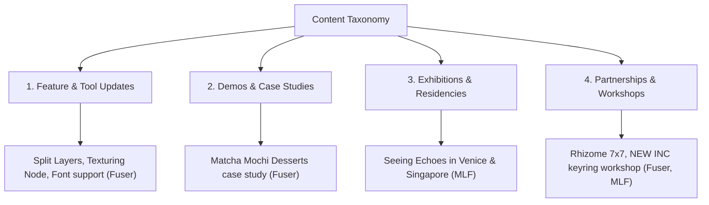

# Instagram Audience Engagement & Content Insights Report

This report compiles an in-depth analysis of posting frequencies, content type taxonomy, media formats, and engagement triggers based on target competitor profile scrapes for **Fuser Studio** (`@fuserstudio`) and **Marshmallow Laser Feast** (`@marshmallowlaserfeast`) over the past month (May 8, 2026 – June 8, 2026). It outlines strategic recommendations for our social media and outreach teams.

---

## 📊 Performance & Posting Frequency

| Metric / Profile | `@fuserstudio` | `@marshmallowlaserfeast` |
| :--- | :--- | :--- |
| **Total Posts (Past Month)** | 12 | 6 |
| **Total Images Captured** | 23 | 18 |
| **Total Videos Captured** | 14 | 4 |
| **Total User Comments** | 17 | 36 |
| **Average Posting Interval** | Every 1–3 days (Highly consistent) | Every 3–10 days (Blocky/Event-driven) |
| **Core Schedule Pattern** | Regular product updates and workflow demos | Project launches, residency announcements, and exhibition closing diaries |

### Frequency Key Findings:
* **Fuser Studio** maintains high top-of-mind awareness through frequent updates. They show incremental features (e.g., keychains, custom font additions, texture creation nodes) to build a steady stream of content.
* **Marshmallow Laser Feast** posts less frequently but operates on an event-driven cluster model. Their posts are concentrated around exhibition openings (e.g., ArtScience Museum Singapore) and closings (Venice Biennale), generating massive waves of high-impact engagement.

---

## 🗂 Content Type Taxonomy

We have categorized the benchmark content into four core pillars:

### 1. Platform & Tool Feature Releases (Feature Updates)
* **`@fuserstudio`** relies heavily on this. They show bite-sized videos showing specific software features:
  * Uploading/scaling custom fonts (June 4)
  * Vector shapes using Recraft V4 compositor node (May 27)
  * Split Layers and layer group controls (May 21)
  * Seamless texture generators (May 20)
  * Saving video frames locally (May 19)

### 2. Client Projects & Creative Demos (Case Studies)
* Shows finished artwork created in the platform to demonstrate capabilities:
  * **`@fuserstudio`'s** *Case Study 011: Deep sea as dessert* (matcha mochi confections, June 5) showing what the software is capable of producing.

### 3. Events & Exhibitions
* **`@marshmallowlaserfeast`** centers their entire profile around physically experiencing their work:
  * Reflecting on *Seeing Echoes in the Mind of the Whale* closing in Venice on World Oceans Day (June 8) and opening in Singapore (June 7).
  * Immersive video teasers of the installation space in Giudecca, Venice (June 5).

### 4. Collaborations & Community Programs
* Dual-authored posts linking creator networks:
  * **`@fuserstudio`** performance Scores with `@socialsoftware_` (June 2) and Community Partner Program launch (May 26).
  * **`@fuserstudio`'s** Rhizome 7x7 commissions with `@newmuseum` (May 22) and their keychain workshop with `@newinc` (May 18).
  * **`@marshmallowlaserfeast`'s** ArtScientists-in-Residence announcement with `@artsciencemuseumsg` (May 14).

---

## 🎥 Media & Format Mix

* **`@fuserstudio`:** Combines short, silent video loops showing tool interactions (9 posts contain video) with swipe-through carousels showcasing workflow nodes. They leverage the 10-image maximum to show outputs first, followed by the specific node graphs that produced them.
* **`@marshmallowlaserfeast`:** Utilizes landscape carousels (4 to 5 images) showing visitor interactions inside high-end galleries. They focus on spatial design, layout, and atmosphere, using video only when showing dynamic, moving projections (e.g., sperm whale bioacoustic visualizations).

---

## 💬 Engagement Triggers & Audience Analysis

An analysis of comments reveals distinct interaction triggers:

### 1. The "Magic" Prompt Request (Fuser Studio)
* Demos that show seamless vector editing or rendering quality textures spark immediate requests for replication.
  * **Trigger:** Text-to-Vector compositor nodes (Post 4) got comments like *"Give us the prompt!!! 🔥"* and *"Ooooo vectors"*.
  * **Insight:** Creators who reveal *how* a visual is created generate higher high-intent feedback than those who only show a static final rendering.

### 2. Practical Developer Application (Fuser Studio)
* Showing concrete workflows invites developer speculation and testing.
  * **Trigger:** Split layer controls (Post 7) prompted developer comments: *"Oo, could see this working well with asset sheets too. Will try this out!"*
  * **Insight:** Practical utility prompts active user intent to test the tool.

### 3. Celebratory Community Nodes (Marshmallow Laser Feast)
* Massive project announcements act as congratulations hubs for peers and institutions.
  * **Trigger:** The ArtScience Museum residency announcement (Post 4) generated 15+ celebratory and emoji-driven comments from artists, museum curators, and design directors.
  * **Insight:** Celebrating peer milestones strengthens community bonds.

### 4. High-Fidelity Sensory Teasers (Marshmallow Laser Feast)
* Showing immersive installations sparks FOMO and travel/location queries.
  * **Trigger:** *Seeing Echoes* openings (Post 2) led to comments like *"Any chance to bring it to malaysia too?"* and reviews like *"Amazing!!! I would drive all the way to Venice Biennale just for this piece!"*

---

## 💡 Key Takeaways & Strategic Recommendations

Based on these findings, we recommend implementing the following actions for our social media strategy:

### A. Leverage Co-Authoring & Collaborators
Both `@fuserstudio` and `@marshmallowlaserfeast` leverage Instagram's **Collab** feature extensively.
* **Action:** When posting about outreach, scripts, or client results, co-author the posts with collaborators (such as n8n, specific developers, or partner agencies). This merges follower bases, aggregates likes/comments, and maximizes organic reach.

### B. The "Output first, Node-graph second" Carousel Strategy
* **Action:** Emulate `@fuserstudio`'s carousel structure. Put a breathtaking visual output as slide 1 (to capture feed attention), and put the node graph, Python code snippet, or n8n pipeline canvas as slide 2/3 (to satisfy technical curiosity).

### C. Prompt/Workflow Sharing as an Engagement Loop
* **Action:** To drive comments, post a gorgeous image/video but keep the text-to-image prompt or JSON workflow configuration hidden. Instruct the audience to *"Comment 'WORKFLOW' and we'll DM you the node configuration / script setup"* to trigger comment loops.

### D. Use Punchy Video Loops for UI, Carousels for Atmosphere
* **Action:** Use short 10–15 second video recordings (captured via Playwright dry-runs) to show software tools performing actions. For physical workshops, events, or static case studies, use high-resolution carousel slides.

---
*Report compiled by **`Media-Scout`** (Instagram Media & Audience Engagement Specialist)*
