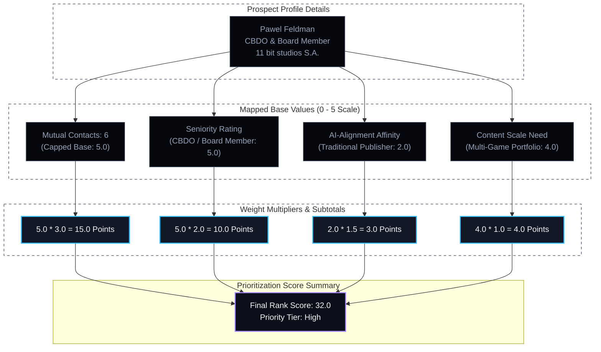

# B2B Lead Evaluation: 11 bit studios S.A.

This document provides a detailed overview and compatibility audit of the Warsaw-based game developer and publisher, **11 bit studios S.A.**, analyzing their business structure, portfolio footprint, and compatibility with the Emergentic automated creative pipeline offerings.

---

## 1. Company Overview

*   **Headquarters:** Warsaw, Poland (WSE: 11B)
*   **Philosophy:** "Meaningful Entertainment" / "Games that Matter."
*   **Business Model:** Hybrid developer-publisher. They develop proprietary mid-to-high-end narrative titles and run a robust publishing division (11 bit publishing) supporting third-party independent developers globally.
*   **Target Contact:** Pawel Feldman (Chief Business Development Officer / Board Member)

### Core Developer Portfolio:
*   **This War of Mine:** Landmark civilian-perspective survival simulation.
*   **Frostpunk & Frostpunk 2:** Society survival/dystopian builder.
*   **The Alters:** Dystopian narrative sci-fi.

### Active Publishing Portfolio:
*   **Moonlighter** (Digital Sun)
*   **Children of Morta** (Dead Mage)
*   **The Thaumaturge** (Fool's Theory)
*   **The Invincible** (Starward Industries)
*   **Indika** (Odd Meter)

---

## 2. B2B Compatibility Scoring

We evaluate 11 bit studios using the Emergentic Client Prioritization Model:

$$\text{Rank Score} = (M \times 3.0) + (R \times 2.0) + (A \times 1.5) + (B \times 1.0)$$

| Metric | Category | Rating (1-5) | Weight | Weighted Score | Heuristic Evaluation |
| :--- | :--- | :---: | :---: | :---: | :--- |
| **$M$** | Mutual Connections | **5.0** (Capped) | $3.0$ | **15.0** | Shares **6 mutual connections** via LinkedIn Sales Navigator. This indicates a warm, highly accessible introduction path. |
| **$R$** | Role Seniority | **5.0** | $2.0$ | **10.0** | Pawel Feldman (CBDO / Board Member) holds strategic oversight of publishing deals, external partnerships, and marketing budgets. |
| **$A$** | Tech AI-Alignment | **2.0** | $1.5$ | **3.0** | Premium game studios are highly protective of IP, game assets, and source code. They rely heavily on proprietary engines and strict legal review pipelines, indicating high initial friction for cloud-based AI tools. |
| **$B$** | Content Scale Need | **4.0** | $1.0$ | **4.0** | Because they manage a **hybrid publishing portfolio** (marketing and localizing trailers, vertical reels, and dev logs for 5–10 active games concurrently), their marketing division deals with heavy asset compilation bottlenecks. |

*   **Total Rank Score:** $15.0 + 10.0 + 3.0 + 4.0 = \mathbf{32.0 \text{ Points}}$
*   **Priority Tier:** **High Priority (Top Tier Target)**

---

## 3. Custom Outreach Staging & Strategy

To bypass 11 bit studios' AI-alignment friction ($A=2.0$), the pitch must avoid generic generative AI hype and focus purely on **operational automation** (ExtendScript, FFmpeg) to solve their multi-title marketing bottlenecks:

### Mapped Pain Points:
1.  **Multi-Language Trailers:** Re-rendering and burn-in of subtitles across 12+ localized languages for trailer drops.
2.  **Social Asset Compilation:** Programmatically formatting vertical video frames (1080x1920) from raw widescreen captures for TikTok/Shorts updates across multiple published games.
3.  **Diarized Dev Logs:** Generating automated transcripts and speaker assignments (WhisperX) for developer diaries.

### Pitch Hook (Parag's Voice):
> *"We automate localized video scaling and subtitle compilations for multi-title game publishers. By linking custom ExtendScript and asset engines, we help marketing teams format and render multi-language trailers programmatically, eliminating manual rendering queues."*

---

## 4. B2B Compatibility Flowchart

*   **Compiled Diagram Image:** [11_bit_studios_scoring.png](file://Agent_Operations/ranking_system/11_bit_studios_scoring.png)

