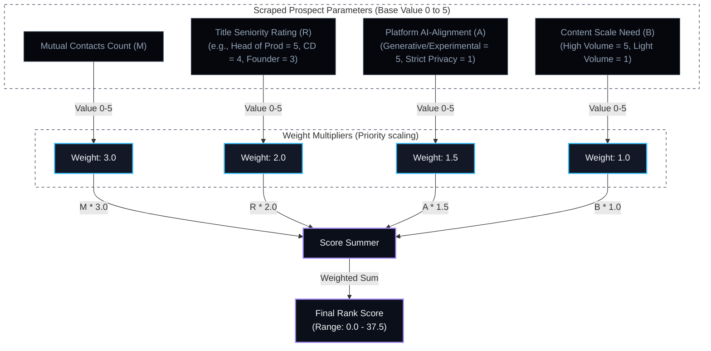
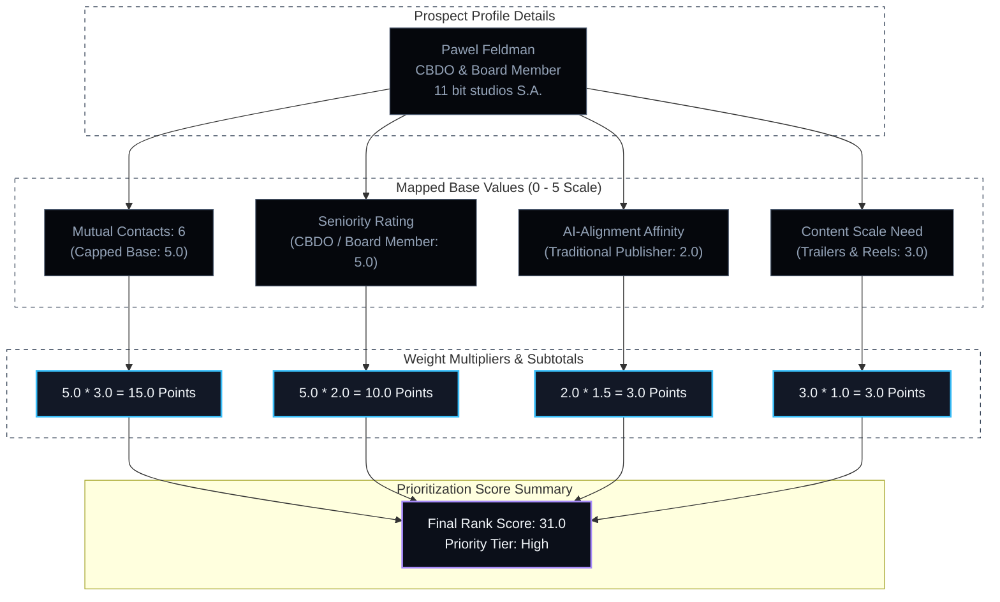

# Emergentic Lead Prioritization & Scoring Engine Report

This report documents the design, formula, and heuristics of the Emergentic client ranking system. It details how scraped data points from LinkedIn Sales Navigator are converted into a single prioritization score to determine campaign outreach order.

---

## 1. Prioritization Scoring Formula

The rank score indicates the overall **adoption chance** and **warm path availability** of a prospect. It is calculated using the following linear equation:

$$\text{Total Rank Score} = (M \times 3.0) + (R \times 2.0) + (A \times 1.5) + (B \times 1.0)$$

### Component Definitions & Weight Scaling:

| Parameter | Metric | Base Scale | Weight | Max Component Score | Description |
| :--- | :--- | :---: | :---: | :---: | :--- |
| **$M$** | Mutual Contacts | $0 - 5$ | $\times 3.0$ | **15.0** | Measures warm path availability (scraped connections). |
| **$R$** | Role Seniority | $1 - 5$ | $\times 2.0$ | **10.0** | Evaluates decision-making and signing authority. |
| **$A$** | Tech AI-Alignment | $1 - 5$ | $\times 1.5$ | **7.5** | Assesses company readiness to adopt automation tools. |
| **$B$** | Content Scale Need | $1 - 5$ | $\times 1.0$ | **5.0** | Measures volume-based rendering bottlenecks. |

* **Score Range:** $3.5$ (minimum) to $37.5$ (maximum priority).

---

## 2. General Scoring Flowchart

*   **Compiled Diagram Image:** [prioritization_flowchart.png](file://Agent_Operations/ranking_system/prioritization_flowchart.png)

---

## 3. What the System is Figuring Out

### A. Mutual Contacts ($M$)
* **Target Objective:** **Accessibility and Warm Path Feasibility.**
* **Mechanism:** Gauges the strength and proximity of shared professional networks. Having mutual connections changes the outreach strategy from a cold pitch to a warm introduction, significantly reducing initial trust friction and increasing LinkedIn response rates.

### B. Title Seniority ($R$)
* **Target Objective:** **Decision-Making and Purchasing Power.**
* **Mechanism:** Identifies where the contact resides in the target company's hierarchy. The engine scores CBDOs, Heads of Production, and Founders highly because they have the direct authority to integrate automated engineering workflows or purchase custom tooling without seeking upward approval.

### C. AI-Alignment Affinity ($A$)
* **Target Objective:** **Cultural Operational Readiness and Friction.**
* **Mechanism:** Mapped based on company output. Traditional developers and highly secure design houses are conservative with public cloud scripts, generative AI, and API integrations, indicating high conversion friction. In contrast, experimental studios, web-native platforms, and AI-enabled brands adopt automation pipelines rapidly.

### D. Content Scale Need ($B$)
* **Target Objective:** **Pain Point Urgency (Bottleneck Severity).**
* **Mechanism:** Analyzes the target's media output volume (videos, trailer cuts, localized promos, social templates). A company with a high volume of output frequently encounters manual rendering bottlenecks, video compilation delays, and formatting overhead, representing a strong, immediate need for custom Python/ExtendScript automation.

---

## 4. Example Target Analysis: Pawel Feldman

### Profile Overview
* **Prospect:** Pawel Feldman (Chief Business Development Officer / Member of the Board)
* **Target Company:** 11 bit studios S.A.
* **Scraped Metrics:** 6 mutual connections, Warsaw-based, traditional console/PC games developer (Witcher co-production, Frostpunk, This War of Mine).

### Scoring Run Heuristics:
1. **Mutual Connections ($M = 5.0$):** Shares 6 mutual contacts. Capped at the maximum base value of 5.0.
2. **Seniority ($R = 5.0$):** CBDO and Board Member status equates to top-tier decision-making authority.
3. **AI Affinity ($A = 2.0$):** 11 bit studios is a traditional game developer. They prioritize custom assets and security over public AI platforms. Their tech alignment rating is conservative ($A = 2.0$).
4. **Scale Need ($B = 3.0$):** High-quality media renders, video trailers, and localized gameplay updates are essential for their publishing arm, but they operate in launch cycles rather than high-frequency daily content formats ($B = 3.0$).

### Formula Calculation:
$$\text{Total Score} = (5.0 \times 3.0) + (5.0 \times 2.0) + (2.0 \times 1.5) + (3.0 \times 1.0)$$
$$\text{Total Score} = 15.0 + 10.0 + 3.0 + 3.0 = \mathbf{31.0 \text{ Points (High Priority Tier)}}$$

---

## 5. Case Study Score Flowchart (Pawel Feldman)

*   **Compiled Diagram Image:** [pawel_feldman_scoring.png](file://Agent_Operations/ranking_system/pawel_feldman_scoring.png)

